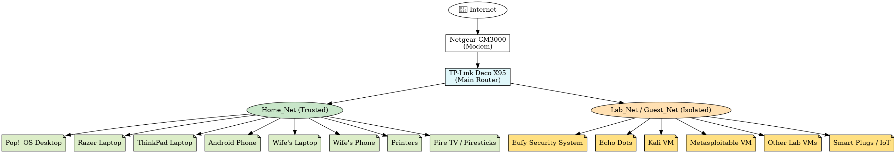

# 🏠 Home Cybersecurity Lab & Network Setup

Welcome to my personal cybersecurity lab, built for hands-on learning in security operations, detection engineering, and incident response. This project documents how I’ve segmented my home network to isolate lab environments and safely simulate attacks, collect logs, and run detection tooling.

---

## 🌐 Network Overview

### 🔹 Network Segmentation

| Network Name | Purpose                       | Isolation Settings                  | Devices                                                                 |
|--------------|-------------------------------|--------------------------------------|-------------------------------------------------------------------------|
| **Home_Net** | Trusted main network          | No isolation                         | Pop!_OS desktop, Razer laptop, Lenovo ThinkPad, Android phone, wife's devices, printers, Fire TV, Firesticks |
| **Lab_Net**  | Cybersecurity lab + IoT       | Guest mode with Device Isolation ON | Eufy security system, Echo Dots, smart plugs/lights, lab VMs, spare laptops |

- **Device Isolation** is enabled on `Lab_Net` to prevent lateral movement.
- Lab virtual machines are hosted on my Pop!_OS desktop, using bridged or isolated interfaces.

---

## 🧪 Lab Environment & Tools

This lab is focused on Blue Team skills — including log ingestion, network traffic inspection, and SIEM integration — while simulating real-world attacks from an attacker VM.

### 🖥️ Virtual Machines
- **Kali Linux** – Attacker box with standard tools
- **Metasploitable 2** – Vulnerable target machine
- **OWASP Juice Shop / DVWA** – Web app vuln practice
- **Ubuntu Server** – Generic log source or target
- **Splunk (Free Tier)** – Core SIEM for log correlation

### 📡 Network Monitoring & Traffic Analysis
- **Wireshark** – Live packet capture and filtering
- **Zeek** *(planned)* – Deep traffic logging & scripting
- **Splunk Universal Forwarder** – Shipping logs from targets

---

## 🛡️ Security Best Practices

- Lab network is segmented from production traffic.
- VMs are snapshot-enabled for fast resets.
- Brute force and scanning attacks are performed in an isolated setting.
- Logs are centralized via Splunk, with plans to add Suricata and Zeek for network-level alerting.

---

## 📜 Certifications & Learning Focus

### ✅ Currently Certified
- CompTIA A+
- CompTIA Network+
- CompTIA Security+

### 🎯 Immediate Goals
- Complete SOC Analyst Career Paths (HTB, Cybrary, TryHackMe)
- Build detection use cases and alerting in Splunk/Wazuh
- Document attack simulation, log analysis, and response workflows

### 🚀 Future Goals
- CompTIA CySA+ and Cisco CyberOps Associate (CCCA)
- Security Engineering or Architect track (post-SOC experience)
- Cloud security fundamentals (Azure, AWS), container security (Docker)

---

## 💻 Cross-Platform Experience

- **Daily Driver:** Pop!_OS (Linux)
- **Lab Systems:** Kali Linux, Ubuntu Server, Windows 10/11, Metasploitable
- **Learning:** macOS logs and security settings (non-hosted)

I aim to stay adaptable across OS environments, especially where log formats and system behaviors differ.

---

## 🖼️ Home Lab Network Diagram



---

## 📁 Repo Structure

---
```
home-lab/
├── README.md
├── network-diagram.png
├── screenshots/
│   └── medusa-ssh-brute.png
├── pcaps/
│   └── traffic-analysis.md
├── lab-configs/
│   ├── kali-notes.md
│   ├── metasploitable.md
│   └── splunk-setup.md
├── attack-scenarios/
│   ├── brute-force-ssh.md
│   ├── sql-injection-dvwa.md
│   └── reverse-shell-kali.md
└── incident-response/
    ├── splunkserver-recovery.md
    └── README.md
```
---

## 📂 Featured Writeups & Walkthroughs

- 🔓 [Brute Force SSH (Medusa)](attack-scenarios/brute-force-ssh.md)
- 💾 [Splunk Setup](lab-configs/splunk-setup.md)
- 🛠️ [Incident: SplunkServer Disk Full Recovery](incident-response/splunkserver-recovery.md)

---

## 🚧 Work in Progress

This lab continues to evolve as I:

- Add more attack simulations and alert testing
- Integrate packet captures (pcaps) and dashboard screenshots
- Deploy Zeek and/or Suricata for enhanced visibility
- Explore Ansible or IaC to automate VM deployments

---

## 🤝 Connect

Got ideas, feedback, or want to collaborate on lab content?  
Feel free to connect through [GitHub](https://github.com/flipxcrsp) or [LinkedIn](https://www.linkedin.com/in/phillip5280)

---

**Maintained by [flipxcrsp](https://github.com/flipxcrsp)**  
*“Documenting the grind, one packet at a time.”*

