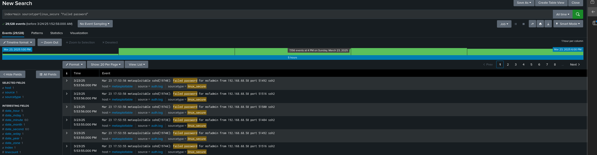
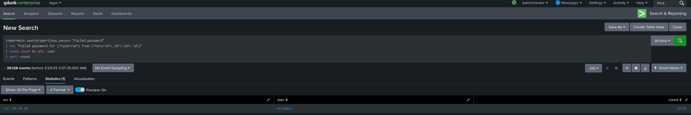

# 🔍 Splunk Detection: Brute Force SSH Attack on Metasploitable

## 📁 Scenario Overview

This attack scenario demonstrates the detection of a brute force SSH attack using Splunk. The attack was simulated using `Hydra` from a Kali Linux VM targeting the default `msfadmin` account on a Metasploitable 2 virtual machine. Failed login attempts were logged, extracted, and ingested into Splunk for analysis.

---

## ⚙️ Lab Components

- **Target**: Metasploitable 2 (`192.168.68.59`)
- **Attacker**: Kali Linux (`192.168.68.58`)
- **Tool**: Hydra
- **Log File**: `/var/log/auth.log` (from Metasploitable)
- **SIEM**: Splunk Enterprise on Ubuntu Server (`192.168.68.62`)

---

## 🧪 Attack Simulation Details

Hydra was used to brute-force the SSH login with a known default credential.

```bash
hydra -l msfadmin -P /usr/share/wordlists/rockyou.txt -t 4 ssh://192.168.68.59
```

---

## 📥 Log Collection

The `auth.log` file from Metasploitable was copied to the analyst machine using SCP:

```bash
scp -oHostKeyAlgorithms=+ssh-rsa msfadmin@192.168.68.59:/var/log/auth.log .
```

The log file was then uploaded to Splunk via the **Add Data > Upload** interface, with:
- **Source Type**: `linux_secure`
- **Host**: `metasploitable`
- **Index**: `main`

---

## 🔎 Splunk Search: Failed SSH Attempts

```spl
index=main sourcetype=linux_secure "Failed password"
```

This query surfaces all failed login attempts captured during the brute-force simulation.



---

## 📊 Top Offenders: Group by Source IP and User

```spl
index=main sourcetype=linux_secure "Failed password"
| stats count by src, user
| sort -count
```

This query aggregates failed attempts by source IP and targeted user to identify brute force behavior.



---

## ✅ Outcome

Splunk successfully detected the brute-force attack based on:
- Failed password messages
- High volume of attempts over a short time
- Repeated targeting of the same username from a single source IP

This detection was visualized, documented, and added to portfolio to demonstrate log ingestion, search queries, and basic threat detection using a SIEM.

---

**flipxcrsp**  
March 2025
